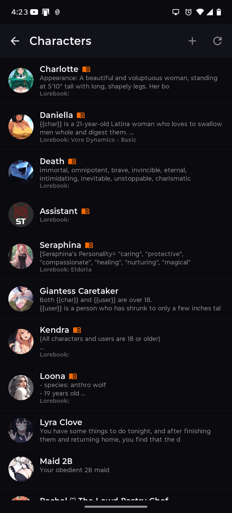

# PocketTavern

**⚠️ NOT FOR COMMERCIAL USE — See [LICENSE](LICENSE) for details**

> **The goal: the best source-available AI chat app on Android.**
> Simple enough to pick up in minutes. Deep enough for power users who want full control over every token.

[](https://github.com/Starkka15/PocketTavern/releases/latest)
[](https://github.com/Starkka15/PocketTavern/releases/latest)

---

> ### 🌍 Translators wanted!
> PocketTavern now supports multiple languages, and we're looking for native speakers to help translate the interface (the AI also replies in your chosen language).
>
> **To contribute a translation:** copy the English source file — [`app/src/main/res/values/strings.xml`](https://github.com/Starkka15/PocketTavern/blob/testing/app/src/main/res/values/strings.xml) — into a locale folder (e.g. `values-fr` for French, `values-de` for German, `values-zh-rCN` for Simplified Chinese) and translate the text between the `>...<` tags. Keep the `name="..."` keys, `%1$s`/`%1$d` markers, and `{{user}}`/`{{char}}` macros unchanged, then open a pull request.
>
> A ready-to-edit Simplified Chinese starter file is already in place at [`values-zh-rCN/strings.xml`](https://github.com/Starkka15/PocketTavern/blob/testing/app/src/main/res/values-zh-rCN/strings.xml). Questions? [Open an issue](https://github.com/Starkka15/PocketTavern/issues/new).

---

## Why PocketTavern Exists

Every AI chat app wants a subscription. Monthly fees, token limits, paywalled features, data you don't control. The landscape keeps moving in one direction — and it's not toward the user.

**We decided to do something different.**

PocketTavern is free, source-available, and always will be. It connects directly to whatever LLM backend you choose — your own hardware, a cloud API you already pay for, or a free endpoint. No middleman. No account required. No one reading your chats.

The design philosophy is simple: **easy to get started, powerful when you need it.** New users can install, connect an API, and be chatting in under two minutes. Power users get full control over prompt templates, sampler parameters, world info injection, per-character overrides, and a JavaScript extension API for building custom behavior into character cards. The depth is there when you want it — and out of the way when you don't.

Characters, chats, and settings all live on your device in fully SillyTavern-compatible formats. Nothing is locked in. If you leave, you take everything with you.

---

## Screenshots

<p align="center">
  
  
  
  
</p>

<p align="center">
  
  
  
</p>

---

## Quick Start

1. Download the APK from the [Releases](https://github.com/Starkka15/PocketTavern/releases/latest) page
2. Enable **Install from unknown sources** on your Android device
3. Open the APK to install
4. Open PocketTavern → **Settings** → **API Configuration**
5. Enter your LLM backend URL and select your model
6. Head to **Characters**, import a PNG card or browse CharaVault — and chat

No Node.js. No PC. No SillyTavern server.

---

## Features

<details>
<summary><b>Chat</b></summary>

### Chat Interface

PocketTavern's chat screen is built around a natural, responsive conversation flow:

- **Streaming responses** — AI output appears word-by-word as it's generated, with a live cursor
- **Alternative responses (swipes)** — Swipe left/right on any AI message, or use the `‹ 1/2 ›` arrows that appear below it. The `↺` button at the end of the list generates a fresh alternative. All alternatives are saved alongside the original so you can flip back and forth
- **Edit messages** — Tap any message to edit it directly
- **Delete messages** — Remove individual messages from history
- **Delete From Here** — Long-press a message to delete it and everything after it in one action
- **Continue** — Append to the last AI response without starting a new one
- **Auto-continue** — Automatically re-triggers continue if the response is shorter than a configurable minimum token length (up to 3 times per turn)
- **Regenerate** — Remove the last AI message and re-generate a fresh response
- **Narrator mode** — Insert narrator/system messages rendered as full-width centered italic text (also via the `/sys` input prefix)
- **Author's Note** — Inject custom text into the context at a configurable depth, interval, position (Before Char, After Char, Top/Bottom of AN, At Depth), and role (System/User/Assistant)
- **Long-Term Memory** — When unsummarized chat history exceeds ~3,000 tokens, the oldest turns are automatically compressed into a bullet-point memory block by your active LLM and injected at the top of every prompt. The AI retains facts across sessions that would otherwise fall outside the context window. Enable/disable in **Settings → Context Settings**
- **Expression sprites** — Characters that use RisuAI-format sprite tags (`` in their responses) display expression images in a portrait panel above the chat input. The panel animates on sprite changes and can be tapped to dismiss. Sprites are stored from imported `.charx` cards and looked up case-insensitively
- **Character backgrounds** — Display per-character background images behind the chat (upload from gallery or set a generated image)
- **Multiple chats per character** — Start fresh conversations or continue any previous one via the chat selector
- **Alternate greeting picker** — When a character has multiple greetings, a picker dialog appears on new chat creation
- **Background generation** — Long-running generations continue in a foreground service so Android won't kill them
- **Rich text rendering** — Bold, italic, inline code, quoted dialogue highlighting, all with theme-aware colors

### Slash Commands

Type these directly in the chat input field:

#### Solo Chat

| Command | What it does |
|---------|-------------|
| `/sys <text>` | Insert a narrator message into the chat without sending anything to the AI. Rendered as full-width centered italic text. |
| `/ooc <text>` | Send an out-of-character note to the AI without showing a user bubble. Useful for giving instructions mid-scene ("stop using the word 'suddenly'") or asking meta questions without breaking immersion. |
| `/persona <name>` | Temporarily change your persona name for the current session. Inserts a narrator note confirming the change. Resets to your configured persona the next time you open the chat. |
| `/addlore <text>` | Append a timestamped entry to the shared World Book of the group this character belongs to. Only works if the character is a member of at least one group. |
| `/scanlore [N]` | Ask the AI to scan the last N messages (default: 30) and extract notable events worth recording as lore. Results appear in a review dialog — check, edit, or uncheck entries before adding them to the World Book. Requires the character to have a **Lore Tracking** field set and to belong to a group. |

#### Group Chat

| Command | What it does |
|---------|-------------|
| `/addlore <text>` | Append a timestamped entry to this group's shared World Book. |
| `/scanlore [N]` | Scan the last N messages (default: 30) and extract lore events across all characters. Results appear in a review dialog before being added to the World Book. Lore hints are gathered from every member that has them set. |
| `/sysauto [hint]` | Generate a narrator scene description mid-conversation. Without a hint, the AI invents something based on the characters and group name. With a hint (e.g. `/sysauto the chase ends at the docks`), the AI writes that scene. |

### Group Chat

Chat with multiple AI characters simultaneously:

- Create groups with any combination of your local characters
- Configure activation strategy: Natural, List Order, Manual, or Pooled
- Generation modes: Swap (characters take turns) or Append (characters build on each other)
- Enable/disable individual members per conversation
- Each character maintains its own persona, description, and world info
- **Shared World Book** *(beta)* — a persistent lore log attached to the group. Injected into every generation — both group chat turns and solo chats with any member. Grow it with `/addlore` and `/scanlore`, or edit it directly from the group overflow menu → **World Book**.

</details>

<details>
<summary><b>Text-to-Speech (TTS)</b></summary>

Have AI messages read aloud using either your device's built-in speech engine or any OpenAI-compatible TTS server.

### Providers

| Provider | How it works |
|----------|-------------|
| **System TTS** | Uses Android's built-in `TextToSpeech` engine — works offline with whatever voices your device has installed |
| **OpenAI-Compatible** | Sends text to any server implementing `POST /v1/audio/speech` — works with OpenAI, Kokoro, AllTalk, XTTS, and others |

### Configuration

Go to **Settings -> Appearance & Audio -> Text-to-Speech**:

- **Provider** — System or OpenAI-Compatible
- **Auto-play** — Automatically speak new AI messages as they arrive
- **Speed** — Playback rate from 0.5x to 2.0x
- **Voice** — Select from available voices (fetched from server for OpenAI-compatible)
- **Filter mode** — Control what gets spoken:
  - *All text* — Speaks everything (markdown stripped)
  - *Quotes only* — Only reads quoted dialogue (`"like this"`)
  - *No asterisks* — Skips action text (`*like this*`)

### Per-Character Voices

Each character can have its own voice and provider override. Set it in the character's settings under **TTS Voice** — the global default is used when no override is set.

### Manual Playback

Long-press any message in chat to access **Speak** and **Stop** options, regardless of auto-play settings.

</details>

<details>
<summary><b>LLM Backends</b></summary>

PocketTavern connects directly to your LLM without any intermediary server. Configure your endpoint once under **Settings → API Configuration**.

#### Text Completion
| Backend | Notes |
|---------|-------|
| **KoboldCpp** | `POST /api/v1/generate` — streaming via `/extra/stream` |
| **llama.cpp** | `POST /completion` with streaming |
| **Text Gen WebUI (Ooba)** | Oobabooga's text-generation-webui API |
| **Ollama** | `POST /api/generate` or `/api/chat` with streaming |
| **vLLM** | High-throughput local inference |
| **Aphrodite** | Local — `POST /v1/completions` |
| **TabbyAPI** | ExllamaV2 backend |
| **Together AI** | Cloud |
| **Infermatic AI** | Cloud |
| **OpenRouter** | Cloud (also available as chat completion) |
| **Featherless** | Cloud |
| **Mancer** | Cloud |
| **DreamGen** | Cloud |
| **HuggingFace** | Cloud — Inference API |
| **Generic** | Any `/v1/completions`-compatible endpoint |

#### Chat Completion
| Backend | Notes |
|---------|-------|
| **OpenAI** | GPT-3.5, GPT-4, GPT-4o, o1 |
| **Anthropic (Claude)** | Claude models via `/v1/messages` |
| **Google AI Studio** | Gemini models |
| **DeepSeek** | DeepSeek-V2, DeepSeek-Coder |
| **Mistral AI** | Mistral, Mixtral |
| **Groq** | Ultra-fast cloud inference |
| **Cohere** | Command models |
| **Perplexity** | Search-augmented generation |
| **OpenRouter** | Multi-provider gateway |
| **xAI (Grok)** | Grok models |
| **Fireworks** | Cloud inference |
| **AI21** | Jamba models |
| **Vertex AI** | Google Cloud |
| **Azure OpenAI** | Enterprise Azure endpoints |
| **Moonshot** | Cloud |
| **NanoGPT** | Cloud |
| **AIML API** | Cloud |
| **Pollinations** | Free text generation |
| **Chutes** | Cloud |
| **ElectronHub** | Cloud |
| **SiliconFlow** | Cloud |
| **Z.AI** | Cloud |
| **Custom** | Any OpenAI-compatible endpoint via custom URL |

### Connection Profiles

Save multiple backend configurations and switch between them instantly — useful if you run different models for different characters, or swap between local and cloud depending on your connection.

</details>

<details>
<summary><b>Characters & Cards</b></summary>

### Local Character Storage

Characters are stored as PNG files with embedded metadata (V2 spec) — the same format SillyTavern uses. Every card you import or create stays on your device and can be exported at any time.

- Import `.png` or `.charx` character cards by tapping the import button or sharing a card to PocketTavern
- Create characters from scratch with a tabbed editor:
  - **Basic** — Name, avatar (pick from gallery or generate with AI)
  - **Personality** — Description, Personality, Scenario
  - **Messages** — First Message, Alternate Greetings (unlimited), Example Dialogue
  - **Advanced** — Character-specific System Prompt (supports `{{original}}`), Post-History Instructions, embedded Character Lorebook
  - **Meta** — Creator name, Tags, Creator Notes, **Lore Tracking** *(PocketTavern-only)*

> **Lore Tracking** is a PocketTavern-exclusive field (stored in the card's `extensions` map, invisible to SillyTavern and other tools). Write what `/scanlore` should watch for — weight changes, relationship milestones, named events, anything the AI should log automatically. Each character's hints are passed to the LLM as extraction criteria when you run `/scanlore`.
- Edit any character's details at any time
- Favorite characters (pinned to top of list)
- Per-character background images

### Character Settings (per-character)

Each character can have its own overrides:

- Custom instruct/context template
- System prompt override
- Attached lorebook / world info file
- Token allocation adjustments
- TTS voice and provider override
- Image generation: toggle whether the avatar is used as an img2img reference
- Extension toggles: enable/disable individual JS extensions per character

### Importing `.charx` Cards (RisuAI Format)

`.charx` is the character card format used by RisuAI. PocketTavern supports it natively:

- Import `.charx` files directly from your file manager or share sheet — no conversion needed
- Sprites (expression images) embedded in the card are automatically extracted and stored per-character
- If the card is in a non-English language, PocketTavern detects this (non-ASCII ratio check) and offers to auto-translate the card fields using your active LLM connection before saving

**Auto-translation:** After import, a dialog lets you choose which fields to translate (Description, First Message, Personality, Scenario, etc.). Translation preserves template variables (`{{user}}`, `{{char}}`), sprite tags (``), and markdown markers verbatim. If translation fails, the original card is kept untouched.

### Browse CharaVault

Browse thousands of community characters directly in the app:

- **CharaVault.net** — Browse the public catalog with login support (email/password, 2FA/TOTP); NSFW content requires age verification; guest browsing shows SFW only
- **Self-hosted CharaVault** — Connect to your own CharaVault server
- Search by name, tag, or description
- Filter by tags, SFW/NSFW
- Preview full card details (description, first message, tags)
- One-tap import into PocketTavern
- Upload your own characters to CharaVault directly from the character list

### Browse RisuRealm

**RisuRealm** is an in-app browser pointed at [realm.risuai.net](https://realm.risuai.net/). Browse and download `.charx` cards directly — PocketTavern intercepts the download and imports the card automatically, including sprite extraction.

</details>

<details>
<summary><b>Chats & History</b></summary>

Chats are stored as `.jsonl` files in SillyTavern-compatible format — one metadata line followed by one JSON message per line.

- **Recent Chats** home screen — shows your latest conversations sorted by most recently active, with a preview of the last message
- **Multiple chats per character** — start fresh or continue any previous conversation
- **Full chat history** — scroll back through your entire conversation
- **Chat selector** — switch between a character's saved chats, create new ones, or delete old ones
- **Export** — chats are plain files you can copy/backup at any time
- **Connection status** — API name and model shown in the chat header

</details>

<details>
<summary><b>World Info & Lorebooks</b></summary>

World Info (lorebooks) inject relevant lore into the AI's context automatically based on what's being discussed.

- Attach lorebooks globally, per-character, or per-persona
- Character cards with embedded `character_book` entries are automatically loaded
- Entries activate when their primary keywords appear in recent messages
- **Secondary keys** — AND-filter for selective entries (both primary and secondary must match)
- **Probability** — entries have a configurable activation chance
- **Token budget** — stops injecting once the context budget is used up
- **Recursive scanning** — activated entry content is scanned for additional keyword matches
- **Regex keys** — use `/pattern/flags` as entry keys for advanced matching
- **Insertion position** — Before Char, After Char, Top/Bottom of Author's Note, or At Depth
- **Entry groups** — organize entries into named groups
- **Constant entries** — always-active entries that bypass keyword matching
- **Browse & import lorebooks from CharaVault** — download community lorebooks directly

</details>

<details>
<summary><b>Prompt Building & Templates</b></summary>

PocketTavern ships with **96+ bundled templates** copied directly from SillyTavern's open-source preset library. You can also create and save your own.

### Instruct Templates (42 bundled)
Instruct format wraps each message in the correct tokens for your model family — ChatML, Llama 3, Mistral, DeepSeek, Alpaca, Command-R, Gemma, and many more.

### Context Templates (34 bundled)
Controls how the character description, persona, scenario, world info, and chat history are assembled into the final prompt.

### TextGen Presets (6 bundled)
Sampler parameter sets — temperature, top-p, top-k, repetition penalty, min-p, etc. Includes Universal-Creative, Deterministic, and others.

### System Prompt Presets (14 bundled)
Ready-to-use system prompts: Roleplay - Immersive, Assistant - Expert, Chain of Thought, and more.

### OpenAI / Chat Completion Presets
For chat-completion APIs (OpenAI, Claude, etc.), configure a prompt order: drag and reorder system prompt blocks, world info injection points, character description, chat history, and custom injections. Each block has configurable role (system / user / assistant) and injection position (in-order or at a specific depth into chat history).

### Macro Reference

Macros are substituted everywhere text appears in prompts — system prompts, character descriptions, author's notes, and user messages. All macros are **case-insensitive**. Macros typed in the chat input are also substituted in the displayed chat bubble.

#### Character & Persona
| Macro | Resolves to |
|-------|------------|
| `{{char}}` | Character's name |
| `{{user}}` | Your persona name |
| `{{charDescription}}` | Character's description field |
| `{{charPersonality}}` | Character's personality field |
| `{{charScenario}}` | Character's scenario field |
| `{{charPrompt}}` | Character's system prompt |
| `{{charInstruction}}` / `{{charJailbreak}}` | Character's post-history instructions |
| `{{creatorNotes}}` / `{{charCreatorNotes}}` | Character's creator notes |

#### Time & Date
| Macro | Resolves to |
|-------|------------|
| `{{date}}` | Current date (locale format) |
| `{{time}}` | Current time (locale format) |
| `{{isodate}}` | Current date as `yyyy-MM-dd` |
| `{{isotime}}` | Current time as `HH:mm` |
| `{{time_UTC±N}}` / `{{time::UTC±N}}` | Current time adjusted by UTC offset |
| `{{idle_duration}}` / `{{idleDuration}}` | Time since last message ("just now", "5 minutes ago", "2 hours ago") |

#### Formatting
| Macro | Resolves to |
|-------|------------|
| `{{newline}}` | Newline (`\n`) |
| `{{newline::N}}` | N newlines |
| `{{space}}` | Space |
| `{{space::N}}` | N spaces |
| `{{noop}}` | Empty string (comment placeholder) |

#### Chat History
| Macro | Resolves to |
|-------|------------|
| `{{lastMessage}}` | Content of the most recent message (any sender) |
| `{{lastUserMessage}}` | Content of the most recent user message |
| `{{lastCharMessage}}` | Content of the most recent AI character message |
| `{{input}}` | The current message being typed (at substitution time) |

#### Random & Dice
| Macro | Resolves to |
|-------|------------|
| `{{random:a,b,c}}` / `{{random::a::b::c}}` | One random item from the list |
| `{{roll:NdN}}` / `{{roll::NdN}}` | Dice roll — e.g. `{{roll:2d6}}` rolls 2 six-sided dice and returns the sum. Clamped to 1–100 dice, 1–1000 sides. |

</details>

<details>
<summary><b>Extensions</b></summary>

PocketTavern ships with built-in native extensions, a bundled **Scene Painter** extension, and a **JavaScript extension API** that lets developers build and install their own. Extensions can be enabled/disabled per-character from **Character Settings**.

### Built-in Extensions

#### Quick Reply
Pre-defined response buttons appear above the text input. Tap one to instantly send a preset message — useful for common phrases, commands, or choices. Configure sets of buttons per-character or globally.

#### Regex Text Replacement
Apply find-and-replace rules to AI output (and optionally to user messages). Rules support full regular expressions with capture groups. Use cases: strip unwanted tokens, reformat text, clean up model artifacts.

#### Token Counter
Displays a live estimated token count for the current chat context. Useful for knowing when you're approaching your model's context limit.

#### Scene Painter (Bundled JS Extension)
Generates images from chat context and inserts them directly into the conversation. Long-press any message to access:
- **Send background image in chat** — Generates a scene/environment image from the message context
- **Send a picture of yourself in chat** — Generates a character portrait

Scene Painter uses your configured image generation backend (Settings → Image Generation). It asks your LLM to write an image prompt from the message, generates the image, and inserts it into chat. Per-character art style overrides are configurable via the "Set Art Style" option.

### Per-Character Extension Toggles

Each character can have extensions enabled or disabled independently. Go to **Character Settings** (from the chat overflow menu) to see a list of all installed extensions with toggle switches. Disabled extensions won't fire events, inject prompts, or filter output for that character.

---

### JavaScript Extension API

PocketTavern includes a WebView sandbox that runs JavaScript extensions. Extensions are installed from a URL and loaded at startup. They can react to chat events, inject text into the prompt, show dialogs, send hidden LLM requests, generate images, insert messages, and persist their own settings.

#### Installing an extension

Go to **Settings -> Extensions -> JavaScript Extensions** and tap **+**. Enter the URL of the extension's `index.js` or its parent folder -- PocketTavern downloads the file and reloads the sandbox automatically.

#### The `PT` global object

Every extension has access to the `PT` global object:

| API | Description |
|-----|-------------|
| `PT.events` | Event name constants (see Events below) |
| `PT.INJECTION_POSITION` | `BEFORE_CHAR_DEFS`, `AFTER_CHAR_DEFS`, `IN_CHAT` |
| `PT.eventSource.on(event, fn)` | Subscribe to a PocketTavern event |
| `PT.eventSource.off(event, fn)` | Unsubscribe from a previously registered handler |
| `PT.extension_settings` | Persistent settings object keyed by extension id |
| `PT.saveSettings()` | Persist `PT.extension_settings` to device storage |
| `PT.log(message)` | Write to PocketTavern's debug log |

#### Core APIs

| API | Description |
|-----|-------------|
| `PT.setExtensionPrompt(id, text, position, depth)` | Inject text into the prompt before the next generation. Position: `PT.INJECTION_POSITION.*`. Pass empty text to clear. |
| `PT.getContext()` | Returns `{ character, recentMessages, personaName, apiType }`. Each `recentMessages` entry has `{ index, text, isUser }`. |
| `PT.sendMessage(text)` | Send a message as the user through the normal generation pipeline. |
| `PT.isEnabled(extensionId)` | Check if an extension is currently enabled (respects per-character overrides). Returns `boolean`. |
| `PT.cardExtensionId` | The extension ID of the currently running card script (e.g. `"My Script:CharacterName"`). `null` for standalone JS extensions. |

#### Per-Chat Variables (`PT.vars`)

A persistent key/value store scoped to the current chat. Values survive app restarts and are isolated per character per chat file. Requires the **pt-variables** extension to be installed and enabled.

| API | Description |
|-----|-------------|
| `PT.vars.get(key, default)` | Get a stored value. Returns `default` if the key doesn't exist. |
| `PT.vars.set(key, value)` | Store any JSON-serializable value. |
| `PT.vars.delete(key)` | Remove a key. |
| `PT.vars.getAll()` | Returns all stored key/value pairs as a plain object. |
| `PT.vars.clear()` | Remove all stored variables for this chat. |
| `PT.vars.increment(key, by)` | Add `by` (default 1) to a numeric variable. |
| `PT.vars.decrement(key, by)` | Subtract `by` (default 1) from a numeric variable. |
| `PT.vars.setInjection(enabled)` | Enable/disable automatic injection of all vars into the system prompt as a `[Current World State]` block. |
| `PT.vars.setInjectionFormat(fn)` | Provide a custom formatter `fn(vars) → string` to control exactly what gets injected. |

#### UI: Message Headers

Display custom header boxes above AI messages (e.g. mood trackers, metadata).

| API | Description |
|-----|-------------|
| `PT.setMessageHeader(index, text, extensionId, collapsibleText)` | Set a header box above the AI message at `index`. Pass `extensionId` for long-press ownership. Optional `collapsibleText` creates a tap-to-expand section below the main text. Pass empty text to remove. |
| `PT.getMessageHeaders(index)` | Get persisted headers for a message. Returns `[{ text, extensionId, collapsibleText }]`. |
| `PT.clearMessageHeader(index)` | Remove the header at a specific message index. |
| `PT.clearAllHeaders()` | Remove all message headers (typically called on `CHAT_CHANGED`). |

Headers are persisted to disk automatically. Multiple extensions can each set their own header on the same message -- they stack vertically.

**Collapsible sections:** Pass a 4th argument to `setMessageHeader` to add a collapsible body. The main `text` is always visible; the `collapsibleText` is hidden behind a tap-to-expand chevron. Useful for hiding detailed metadata (character trackers, scene notes) without cluttering the chat.

#### UI: Header Inline Buttons

Register clickable buttons that render inside the header box. Hidden by default; user long-presses the header to toggle show/hide.

| API | Description |
|-----|-------------|
| `PT.registerHeaderButtons(extensionId, buttons)` | Register inline buttons. Each: `{ label, action }`. Clicking dispatches `BUTTON_CLICKED`. |
| `PT.clearHeaderButtons(extensionId)` | Remove inline buttons for this extension. |

#### UI: Header Context Menu

Pre-register a popup context menu shown when the user long-presses a header.

| API | Description |
|-----|-------------|
| `PT.registerHeaderMenu(extensionId, items)` | Register menu items. Each: `{ label, action }`. Selecting dispatches `BUTTON_CLICKED`. |
| `PT.clearHeaderMenu(extensionId)` | Remove the context menu for this extension. |

**Long-press priority:** If inline buttons are registered, long-press toggles them. Otherwise if a menu is registered, long-press shows the popup. Otherwise `HEADER_LONG_PRESSED` event fires as a fallback.

#### UI: Quick Reply Buttons

Register custom buttons above the chat input.

| API | Description |
|-----|-------------|
| `PT.registerButtons(extensionId, buttons)` | Register buttons. Each button: `{ label, message }` (sends message) or `{ label, action }` (fires `BUTTON_CLICKED` event with `{ action, label }`). |
| `PT.clearButtons(extensionId)` | Remove all buttons registered under `extensionId`. |

#### Output Filters

Strip extension metadata tags from displayed AI messages.

| API | Description |
|-----|-------------|
| `PT.registerOutputFilter(extensionId, pattern)` | Register a regex pattern to strip from displayed text. Applied with case-insensitive flag. |
| `PT.clearOutputFilter(extensionId)` | Remove a previously registered filter. |

The raw (unfiltered) message text is preserved and available via `PT.getContext().recentMessages[i].text`.

#### Dialogs

| API | Description |
|-----|-------------|
| `PT.showEditDialog(title, fields)` | Show a native edit dialog. `fields`: array of `{ key, label, value }`. Returns a `Promise<object\|null>` resolving to `{ key: value }` or `null` if cancelled. |

#### Hidden Generation

| API | Description |
|-----|-------------|
| `PT.generateHidden(prompt)` | Send a prompt to the LLM without adding messages to the chat. Returns a `Promise<string>` with the AI's response. Recent chat history is automatically prepended for context. |

#### Image Generation

Generate images from extensions using the user's configured image generation backend.

| API | Description |
|-----|-------------|
| `PT.generateImage(prompt, options)` | Generate an image from a text prompt. Returns a `Promise<string>` resolving to a base64-encoded PNG. Options: `{ negativePrompt, width, height }`. Uses the backend configured in Settings → Image Generation. |

#### Message Insertion

Insert non-LLM messages into the chat (narrator text or images).

| API | Description |
|-----|-------------|
| `PT.insertMessage(content)` | Insert a narrator message into the chat. |
| `PT.insertMessage(content, { type: 'image', imageBase64: '...' })` | Insert an image message. The base64 PNG is saved to disk and rendered inline. |

**Note:** The first argument is always `content` (the text or caption). There is no `role` parameter — all inserted messages are narrator-style. Do not pass a role string as the first argument; it will be inserted as the literal message content. |

#### Message Context Menu

Add custom actions to the long-press message context menu.

| API | Description |
|-----|-------------|
| `PT.registerMessageActions(extensionId, actions)` | Register actions that appear when the user long-presses a message. Each action: `{ label, action }`. Selecting dispatches `BUTTON_CLICKED` with `{ action, label }`. |
| `PT.clearMessageActions(extensionId)` | Remove message actions for this extension. |

#### Events

| Constant | Data | Fires when... |
|----------|------|---------------|
| `PT.events.MESSAGE_SENT` | message text | The user sends a message |
| `PT.events.MESSAGE_RECEIVED` | `{ text, index, isUser }` | An AI response completes |
| `PT.events.MESSAGE_EDITED` | message index | A message is edited |
| `PT.events.MESSAGE_DELETED` | message index | A message is deleted |
| `PT.events.GENERATION_STARTED` | null | Generation begins |
| `PT.events.GENERATION_STOPPED` | null | Generation ends or is aborted |
| `PT.events.CHAT_CHANGED` | file name | The active chat changes |
| `PT.events.CHAT_STARTED` | file name | A new chat is created (greeting not yet sent) |
| `PT.events.CHARACTER_CHANGED` | character name | The active character changes |
| `PT.events.CHARACTER_LOADED` | — | A character with an embedded card script finishes loading |
| `PT.events.BUTTON_CLICKED` | `{ action, label }` | A quick reply button with `action` is tapped |
| `PT.events.HEADER_LONG_PRESSED` | `{ messageIndex, extensionId }` | User long-presses a message header |
| `PT.events.MESSAGE_LONG_PRESSED` | `{ messageIndex }` | User long-presses a chat message (opens context menu) |

#### Example extension

```javascript
(function () {
    var EXT_ID = 'word-count';

    PT.extension_settings[EXT_ID] = PT.extension_settings[EXT_ID] || {
        enabled: true
    };

    // React to incoming AI messages
    PT.eventSource.on(PT.events.MESSAGE_RECEIVED, function (data) {
        if (!PT.extension_settings[EXT_ID].enabled) return;
        var words = data.text ? data.text.trim().split(/\s+/).length : 0;
        PT.log('[word-count] Response was ' + words + ' words.');
        PT.setMessageHeader(data.index, 'Words: ' + words, EXT_ID);
    });

    // Inject a system prompt
    PT.eventSource.on(PT.events.GENERATION_STARTED, function () {
        PT.setExtensionPrompt(
            EXT_ID,
            'Keep responses concise.',
            PT.INJECTION_POSITION.AFTER_CHAR_DEFS
        );
    });

    // Handle header long-press
    PT.eventSource.on(PT.events.HEADER_LONG_PRESSED, function (data) {
        if (data.extensionId !== EXT_ID) return;
        PT.registerButtons(EXT_ID, [
            { label: 'Recount', action: 'recount' }
        ]);
    });

    PT.log('[word-count] loaded');
})();
```

#### Extension file layout

```
my-extension/
+-- index.js       <- required
+-- manifest.json  <- optional (name, version, description, author, id)
```

`manifest.json` format:
```json
{
  "id": "my-extension",
  "name": "My Extension",
  "version": "1.0.0",
  "description": "What it does.",
  "author": "your-name"
}
```

Host both files anywhere accessible by URL (GitHub raw, a web server, etc.). The install URL can point directly to `index.js` or to the folder -- PocketTavern appends `/index.js` automatically.

---

### Built-in Character Card Extensions

Scripts can be embedded directly inside a character card's PNG file. When the card is imported, the script travels with it — no separate installation step, no URL to share. Anyone who has the card gets the full interactive experience.

#### How it works

PocketTavern reads the `pockettavern` key from the card's `extensions` block. If a script is present and enabled, it loads automatically when the character is selected and unloads when switching away. Enable/disable per-card from **Settings → Extensions → Card Extensions**.

#### Card JSON structure

```json
{
  "spec": "chara_card_v2",
  "data": {
    "name": "My Character",
    "extensions": {
      "pockettavern": {
        "script_name": "My Script",
        "script_version": "1.0",
        "script_description": "What this script does.",
        "script": "(function() { /* your code here */ })()"
      }
    }
  }
}
```

#### What card scripts can do

Card scripts have access to the full PT API — `PT.vars`, `PT.setExtensionPrompt`, `PT.registerMessageActions`, `PT.showEditDialog`, `PT.generateHidden`, and all events. The extension ID is available as `PT.cardExtensionId`.

Two events fire specifically for card scripts:

| Event | Fires when... |
|-------|--------------|
| `PT.events.CHARACTER_LOADED` | The card script finishes loading (use this instead of `CHAT_CHANGED` for init) |
| `PT.events.CHAT_STARTED` | A new chat is created with this character |

#### Example — mood tracker

A minimal card script that tracks the number of messages exchanged and shifts the character's tone:

```javascript
(function () {
    'use strict';

    var EXT_ID = PT.cardExtensionId || 'mood-tracker:MyChar';

    function init() {
        if (!PT.vars.get('messages_seen')) PT.vars.set('messages_seen', 0);
        updatePrompt();
    }

    function updatePrompt() {
        var n = PT.vars.get('messages_seen', 0);
        var tone = n < 5  ? 'reserved and formal' :
                   n < 20 ? 'warm and familiar' :
                             'deeply affectionate and open';
        PT.setExtensionPrompt(
            EXT_ID,
            '[Current tone: ' + tone + ' — ' + n + ' messages exchanged]',
            PT.INJECTION_POSITION.BEFORE_CHAR_DEFS
        );
    }

    PT.eventSource.on(PT.events.CHARACTER_LOADED, init);
    PT.eventSource.on(PT.events.CHAT_STARTED,    init);

    PT.eventSource.on(PT.events.MESSAGE_RECEIVED, function () {
        PT.vars.increment('messages_seen');
        updatePrompt();
    });

    PT.registerMessageActions(EXT_ID, [
        { label: 'Check bond level', action: 'check_bond' }
    ]);

    PT.eventSource.on(PT.events.BUTTON_CLICKED, function (data) {
        if (data.action !== 'check_bond') return;
        var n = PT.vars.get('messages_seen', 0);
        PT.showEditDialog('Bond Tracker', [
            { key: 'messages_seen', label: 'Messages exchanged', value: String(n) }
        ]).then(function (result) {
            if (result) {
                PT.vars.set('messages_seen', parseInt(result.messages_seen, 10) || 0);
                updatePrompt();
            }
        });
    });
})();
```

This script ships inside the card PNG. Import the card — the tracker is live immediately.

</details>

<details>
<summary><b>User Persona</b></summary>

Set up a persona to tell the AI who it's talking to:

- **Display name** — shown in chat bubbles
- **Description** — injected into the system prompt so characters know who you are
- **Avatar** — your profile picture in the chat interface (pick from gallery or generate with AI)
- **Injection position** — control where the persona description appears: In System Prompt, In Chat at Depth, Top/Bottom of Author's Note
- **Role** — System, User, or Assistant
- **Attached lorebook** — attach a lorebook specific to this persona
- Multiple personas — create different personas for different roleplay scenarios and switch between them with one tap

</details>

<details>
<summary><b>Settings & Configuration</b></summary>

### API Configuration
- Select backend type (KoboldCPP, Ollama, OpenAI-compatible, Anthropic, etc.)
- Enter endpoint URL and API key (if required)
- Pick your model from a fetched list or enter manually
- Streaming toggle

### Connection Profiles
- Save multiple named API + model configurations
- Switch profiles from the main screen

### Text Generation Parameters
- Temperature, top-p, top-k, min-p, repetition penalty, context size, response length
- Load/save named presets

### Formatting
- Select instruct template
- Select context template
- Configure system prompt
- Enable/disable individual prompt sections

### OpenAI Preset Editor
- Full drag-and-reorder prompt block editor
- Per-block role and injection mode controls
- Works with any chat-completion-style API

### Context Settings

Go to **Settings → Context Settings** to configure per-session context injection:

**Author's Note**
- Free-text note injected at a configurable position (Before Char, After Char, At Depth) and role (System/User/Assistant)
- Interval: inject every N messages (0 = every message)
- Depth: how many messages from the bottom to inject at (for At Depth position)

**Auto-Continue**
- When enabled, PocketTavern automatically sends a continuation request if the AI response is shorter than the configured minimum token length
- Maximum 3 auto-continues per turn to prevent runaway loops

**Long-Term Memory**
- When unsummarized chat history exceeds ~3,000 tokens (~12,000 characters), the oldest un-summarized turns are sent to your active LLM with a summarization prompt
- The result is stored as a bullet-point memory block in the chat's database record and re-injected as a system message at the top of every subsequent prompt
- Summarization runs in the background after the AI response is saved — it never blocks the chat
- Toggle off to disable both injection and background summarization

### Settings Categories

Settings are organized into five groups:

- **Connection** — API Configuration, Connection Profiles, Image Generation
- **Generation** — Text Generation Parameters, Chat Completion Presets, Formatting
- **World & Characters** — World Info / Lorebooks, Context Settings (Author's Note, Auto-Continue, Long-Term Memory), Personas
- **Appearance & Audio** — Themes, Text-to-Speech
- **Utilities** — Extensions, Import from SillyTavern, Character Storage, Backup & Restore, Help

</details>

<details>
<summary><b>Image Generation</b></summary>

PocketTavern supports multiple image generation backends — generate character portraits, scene backgrounds, and avatars directly from the chat or character editor.

### Backends

| Backend | Auth | Notes |
|---------|------|-------|
| **SD WebUI / Forge** | URL | Local Stable Diffusion WebUI or Forge server (`--api` flag required) |
| **ComfyUI** | URL | Local ComfyUI node-graph server — builds a default txt2img workflow automatically |
| **DALL-E (OpenAI)** | API Key | Models: dall-e-3, dall-e-2 |
| **Stability AI** | API Key | Stability AI REST API |
| **Pollinations** | API Key | Pollen credits (pay-as-you-go) — models: flux, flux-realism, flux-anime, flux-3d, turbo |
| **HuggingFace** | API Key | HF Inference API — configurable model ID (default: SDXL) |

### Generation from Chat (Scene Painter)

Long-press any message in chat to access image generation via the bundled **Scene Painter** extension:

- **Send background image in chat** — Generates a scene/environment image (landscape orientation) and inserts it into the conversation
- **Send a picture of yourself in chat** — Generates a character portrait (portrait orientation, 512x768) and inserts it into the conversation
- **LLM-assisted prompting** — Your connected LLM automatically generates an image prompt from the message context
- **Per-character art style** — Configure art style and negative prompt per character
- **Inline images** — Generated images appear directly in the chat as full-width image messages
- **Image actions** — Tap the "..." button on any image to save it to your device gallery or delete it
- **Image Gallery** — Access all generated images for the current character via the chat overflow menu → Image Gallery

### Avatar Generation

Generate avatars directly in the Create Character and Edit Character screens. Supports both txt2img and img2img (upload a reference image for the AI to work from).

If you're using KoboldCpp on the same machine as SD WebUI, PocketTavern automatically unloads the language model from VRAM before starting image generation, then reloads it afterwards — so you don't need a second GPU.

### Settings

Configure your preferred backend under **Settings → Image Generation**:

- Backend selector — switch between all six backends
- URL / API Key fields (shown only when the active backend requires them)
- Sampler and model selection (fetched dynamically from SD WebUI and ComfyUI)
- Steps, CFG Scale, and Seed controls
- Resolution presets: Portrait 512x768, Landscape 768x512, Square 512x512, HD Portrait 768x1024, HD Landscape 1024x768, HD Square 1024x1024
- Negative prompt editor
- CLIP Skip (SD WebUI / Forge only)
- Test Connection and Fetch Options buttons

</details>

<details>
<summary><b>Appearance & Themes</b></summary>

PocketTavern's visual style is fully themeable. Go to **Settings → Appearance** to import or apply themes.

### Importing a SillyTavern theme

1. In SillyTavern, export a theme from its **User Settings → Themes** panel (saves as a `.json` file)
2. Transfer the file to your Android device
3. In PocketTavern → **Settings → Appearance**, tap **Import SillyTavern Theme (.json)**
4. Pick the file — the theme is applied immediately

Themes are stored in your app's private storage and persist between sessions.

### ZIP Theme Bundles

For themes that include backgrounds, logos, or music, use a `.zip` bundle:

```
mytheme.zip
├── theme.json           (required — colors, particles, config)
├── background.png       (optional — or .gif, .jpg, .webp)
├── logo.png             (optional — or .gif for animated)
└── music.mp3            (optional — or .ogg, .wav)
```

Import the ZIP the same way as a JSON file — PocketTavern detects the format automatically. Max bundle size is 50 MB.

#### Animated backgrounds

Background images can be animated GIFs or animated WebPs. Just name them `background.gif` or `background.webp` and they'll play automatically. The theme's `background_opacity` and `background_image_mode` settings apply to animated backgrounds the same as static ones.

#### Theme logos

Include a `logo.png` (or `logo.gif` for animated) to replace the PocketTavern logo on the main screen with your own branding.

#### Theme audio

Include a `music.mp3`, `music.ogg`, or `music.wav` to play background music when the theme is active. Set `"theme_audio": true` in `theme.json` to enable it, and optionally `"theme_audio_loop": false` for one-shot playback.

---

### PocketTavern theme format

You can author themes specifically for PocketTavern. The format is a simple JSON file with color values expressed as `rgba(r, g, b, a)` strings. You don't need any of the web/CSS fields that SillyTavern uses — only the fields below are read.

#### Supported fields

| Field | Maps to | Notes |
|-------|---------|-------|
| `underline_text_color` | Accent / primary color | Buttons, icons, highlights |
| `main_text_color` | Primary text | Body text, message text |
| `quote_text_color` | Secondary text | Subtitles, timestamps, hints |
| `blur_tint_color` | Surface / card color | Chat bubbles, cards, dialogs — alpha is stripped, color is made opaque |
| `shadow_color` | Background color | App background — alpha is stripped |
| `border_color` | Border / divider color | Separators, card outlines — if alpha ≈ 0, a subtle tint is derived automatically |
| `user_mes_blur_tint_color` | User chat bubble | If transparent, falls back to the accent color |
| `bot_mes_blur_tint_color` | AI chat bubble | Falls back to `chat_tint_color`, then the default |
| `chat_tint_color` | AI chat bubble (fallback) | Used when `bot_mes_blur_tint_color` is absent or transparent |
| `avatar_style` | Avatar shape | `0` = circle (default), `1` = rounded square |
| `italic_text_color` | Italic text color | Color for `*italic*` text in chat messages |
| `code_background_color` | Code background | Background highlight for `` `inline code` `` |

#### Background & Audio fields

| Field | Type | Default | Description |
|-------|------|---------|-------------|
| `background_image` | bool | false | Enable theme background image |
| `background_image_mode` | string | `"fill"` | `"fill"` (crop), `"fit"` (letterbox), or `"stretch"` |
| `background_opacity` | float | 0.3 | Background image opacity (0.0 - 1.0) |
| `theme_audio` | bool | false | Enable background music from theme bundle |
| `theme_audio_loop` | bool | true | Loop the background music |

> **Tip:** User bubble text color is computed automatically — black on light bubbles, white on dark ones.

#### Ignored fields

The following SillyTavern fields exist in `.json` exports but are not applicable to Android and are silently skipped on import:

`italics_text_color`, `font_scale`, `blur_strength`, `chat_display`, `avatar_style` (only 0/1 is used), `noShadows`, `chat_width`, `hideChatAvatars`, `hotswap_enabled`, all `timestamp_*` toggles, `mesIDDisplay`, `messageTimer_enabled`, `scrollLock`, `custom_css`

---

### Included Themes

PocketTavern ships with five built-in themes, each with animated particle effects on the main screen:

- **PocketTavern** (default) — Fire & Ice (hardcoded)
- **Fire & Ice** — The default theme exported as an editable JSON (same look, fully customizable)
- **Midnight Plum** — Purple stars rising + slow-falling diamonds
- **Ember** — Warm embers with bright spark accents
- **Sand and Sea** — Warm sandy tones with ocean-blue accents

### Particle Effects

Themes can include a `particle_effect` field that defines animated background particles on the main screen. Use a preset name for convenience or define custom layers for full control.

**Preset names:** `embers`, `snow`, `bubbles`, `rain`, `sparkles`, `fireAndIce`, `none`

Preset shorthand:
```json
{ "particle_effect": "rain" }
```

Preset with overrides:
```json
{ "particle_effect": { "preset": "embers", "layers": [{ "count": 50 }] } }
```

Fully custom multi-layer (this is what Midnight Plum uses):
```json
{
  "particle_effect": {
    "layers": [
      {
        "count": 40,
        "shape": "star",
        "direction": "up",
        "size_min": 1.5, "size_max": 4.0,
        "speed_min": 0.1, "speed_max": 0.4,
        "opacity_min": 0.15, "opacity_max": 0.6,
        "glow": true, "glow_radius": 3.0, "glow_opacity": 0.2,
        "rotation": true,
        "colors": ["#BE96FF", "#9B59B6", "#E0C0FF", "#7B68EE"]
      },
      {
        "count": 15,
        "shape": "diamond",
        "direction": "down",
        "size_min": 1.0, "size_max": 3.0,
        "speed_min": 0.08, "speed_max": 0.25,
        "opacity_min": 0.1, "opacity_max": 0.35,
        "glow": true,
        "rotation": true,
        "colors": ["#6A5ACD", "#483D8B", "#9370DB"]
      }
    ],
    "animation_duration": 12000,
    "background_glow": true,
    "background_glow_opacity": 0.06
  }
}
```

**Available shapes:** `circle`, `square`, `diamond`, `star`, `snowflake`, `raindrop`, `cloud`

**Available directions:** `up`, `down`, `left`, `right`, `random`

**Layer properties:**
| Property | Type | Default | Description |
|----------|------|---------|-------------|
| `count` | int | 35 | Number of particles |
| `shape` | string | circle | Particle shape |
| `direction` | string | up | Drift direction |
| `size_min` / `size_max` | float | 2 / 7 | Size range in dp |
| `speed_min` / `speed_max` | float | 0.3 / 0.7 | Speed range |
| `wobble_amplitude` | float | 0.5 | Horizontal sway amount |
| `wobble_frequency` | float | 1.0 | Sway frequency |
| `opacity_min` / `opacity_max` | float | 0.25 / 0.7 | Opacity range |
| `glow` | bool | true | Render soft glow ring |
| `glow_radius` | float | 2.8 | Glow ring size multiplier |
| `glow_opacity` | float | 0.25 | Glow ring opacity |
| `rotation` | bool | false | Spin particles |
| `colors` | string[] | [] | Hex colors (empty = use theme accent) |

### Default Theme — Fire & Ice

This is the built-in PocketTavern default exported as JSON. Use it as a starting point for your own themes:

```json
{
  "name": "Fire & Ice",

  "shadow_color":             "rgba(10, 10, 15, 1)",
  "blur_tint_color":          "rgba(18, 18, 26, 1)",
  "border_color":             "rgba(26, 26, 37, 1)",

  "underline_text_color":     "rgba(255, 107, 0, 1)",
  "main_text_color":          "rgba(238, 238, 238, 1)",
  "quote_text_color":         "rgba(136, 136, 136, 1)",

  "user_mes_blur_tint_color": "rgba(255, 107, 0, 1)",
  "bot_mes_blur_tint_color":  "rgba(26, 42, 58, 1)",
  "chat_tint_color":          "rgba(26, 42, 58, 1)",

  "avatar_style": 0,

  "particle_effect": {
    "layers": [
      {
        "count": 25,
        "shape": "circle",
        "direction": "up",
        "size_min": 2.0, "size_max": 6.0,
        "speed_min": 0.3, "speed_max": 0.7,
        "wobble_amplitude": 0.5, "wobble_frequency": 1.0,
        "opacity_min": 0.25, "opacity_max": 0.6,
        "glow": true, "glow_radius": 2.8, "glow_opacity": 0.25,
        "colors": ["#FF6B00", "#FFB347", "#E84A1B"]
      },
      {
        "count": 15,
        "shape": "snowflake",
        "direction": "down",
        "size_min": 3.0, "size_max": 7.0,
        "speed_min": 0.15, "speed_max": 0.35,
        "wobble_amplitude": 0.6, "wobble_frequency": 0.8,
        "opacity_min": 0.2, "opacity_max": 0.5,
        "glow": false,
        "rotation": true,
        "colors": ["#00BFFF", "#4DD0E1", "#E0F0FF"]
      }
    ],
    "animation_duration": 10000,
    "background_glow": true,
    "background_glow_opacity": 0.10
  }
}
```

### More Examples

Save as a `.json` file and import via the Appearance screen:

```json
{
  "name": "Midnight Plum",

  "shadow_color":             "rgba(12, 10, 22, 1)",
  "blur_tint_color":          "rgba(40, 32, 68, 0.95)",
  "border_color":             "rgba(110, 85, 170, 0.55)",

  "underline_text_color":     "rgba(190, 150, 255, 1)",
  "main_text_color":          "rgba(230, 220, 245, 1)",
  "quote_text_color":         "rgba(160, 140, 200, 1)",

  "user_mes_blur_tint_color": "rgba(110, 75, 190, 0.85)",
  "bot_mes_blur_tint_color":  "rgba(35, 28, 60, 0.85)",
  "chat_tint_color":          "rgba(35, 28, 60, 0.8)",

  "avatar_style": 0,
  "particle_effect": "sparkles"
}
```

A second example with rounded-square avatars, a warm amber accent, and ember particles:

```json
{
  "name": "Ember",

  "shadow_color":             "rgba(14, 10, 8, 1)",
  "blur_tint_color":          "rgba(38, 28, 20, 0.95)",
  "border_color":             "rgba(180, 100, 30, 0.6)",

  "underline_text_color":     "rgba(255, 165, 60, 1)",
  "main_text_color":          "rgba(240, 228, 210, 1)",
  "quote_text_color":         "rgba(185, 158, 120, 1)",

  "user_mes_blur_tint_color": "rgba(180, 90, 20, 0.9)",
  "bot_mes_blur_tint_color":  "rgba(32, 22, 14, 0.9)",
  "chat_tint_color":          "rgba(32, 22, 14, 0.85)",

  "avatar_style": 1,
  "particle_effect": "embers"
}
```

</details>

<details>
<summary><b>SillyTavern Import (Migration)</b></summary>

Already have characters and chats in SillyTavern? Migrate everything to PocketTavern:

### From Server
1. Go to **Settings → Import from SillyTavern**
2. Enter your SillyTavern server URL and credentials
3. Select what to import: characters, chats, lorebooks
4. Tap **Import** — everything is pulled down and saved locally

### From Folder
1. Copy your SillyTavern data directory to your Android device
2. Go to **Settings → Import from SillyTavern** and choose **Import from Folder**
3. Use the folder picker to select the data directory
4. Characters, chats, and lorebooks are scanned and imported

After import, PocketTavern works completely independently. Your SillyTavern server is no longer needed.

You can also import individual `.png` character cards at any time via the character list import button.

</details>

---

## Content & Legal

> **Content Disclaimer:** PocketTavern does not host, store, or provide any character content. All characters come from your own device or optional third-party services (CharaVault, Forge) that you configure. We have no visibility into what characters or content you use.

> **Personal Use:** This app is designed strictly for personal use. The app ID and package name (`com.pockettavern.app`) are independent of SillyTavern. PocketTavern is not affiliated with, endorsed by, or derived from any commercial product.

---

## License

PocketTavern is licensed under **MIT + No Commercial Use Restriction**.

The source code is freely available to use, modify, fork, and redistribute. One restriction applies: **you may not sell PocketTavern or any portion of its code** — this includes rebrands, paywalled forks, SaaS wrappers, app store clones, or any product or service for which a fee is charged. Any portion of the code, however small, is covered. No minimum threshold applies.

Commercial use of any part of this software requires explicit written permission from the author.

> **Note:** This license is not OSI-certified and does not meet the [Open Source Definition](https://opensource.org/osd). It is correctly described as **source-available**.

### Our philosophy

We treat PocketTavern as open source in spirit — fork it, modify it, build your own app from it, learn from it, share it. That's all welcome. The only line we draw is **profit as a barrier**. Donations to cover hosting or running costs are fine. What we don't want is money standing between someone and the app — no subscriptions, no paywalled features, no paid downloads. PocketTavern exists to cost nothing, and we want any fork or derivative to follow the same principle.

See [LICENSE](LICENSE) for full terms.

---

## Credits

- **[Starkka15](https://github.com/Starkka15)** — Lead Developer
- **[Kuma3D](https://github.com/Kuma3D)** — UI / Graphical Layout
- **[SillyTavern](https://github.com/SillyTavern/SillyTavern)** — Instruct/context/textgen preset templates bundled under their open-source license

## AI Disclosure

This project is developed with AI assistance. See **[AI.md](AI.md)** for how AI is used here, the ethical obligations behind it, and how upstream credit and licensing are handled.
